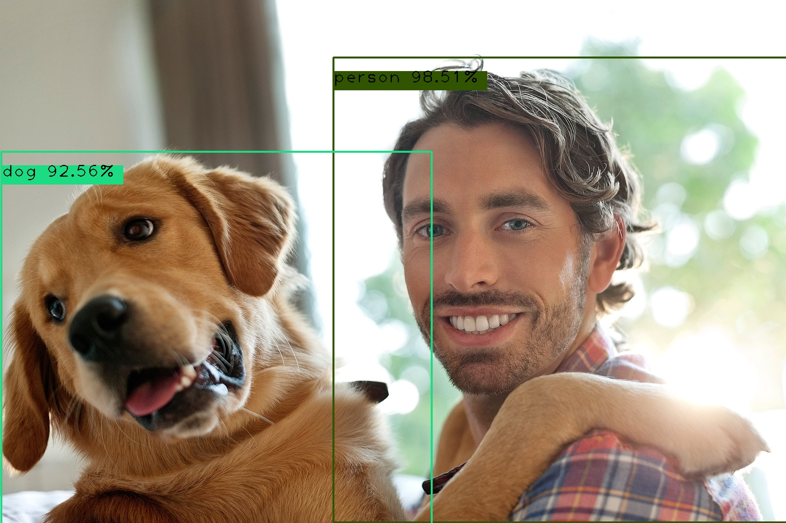

## FastAPI Machine learning apps 

[](https://www.python.org/)                 
[](https://www.python.org/downloads/release/python-360/)

Just a collection of simple machine learning apps built and deployed using FastAPI and Python.

- [Heart disease prediction app](https://fastapi-ml-apps.herokuapp.com/heartdisease)
- [Sentiment analysis app (NLP)](https://fastapi-ml-apps.herokuapp.com/moviessentiment)
- [Object detection app (Computer vision)](https://fastapi-ml-apps.herokuapp.com/object-detection)
- Flower multi-classification app (Computer vision)

## Running the app 

**1.** Running the app locally on a development server

Clone the repository :- 
```
$ git clone https://github.com/rexsimiloluwah/fastapi-ml-apps.git
$ mkdir fastapi-ml-apps
```
Install requirements/ app dependencies :- 
```
$ pip install -r requirements.txt
```

Run the app :- 
```
$ cd app && python main.py
```
> View the app on http://localhost:5000

**2.** Running the app via Docker 
```
$ docker run --rm -p 5050:5050 similoluwaokunowo/fastapi-ml-apps
```

> View the app on http://localhost:5050

Pulling the docker image
```
$ docker pull similoluwaokunowo/fastapi-ml-apps
```

*Computer vision app is not live yet due to slug size issues with tensorflow and keras 

> All APIs are available on http://localhost:5000/docs locally or fastapi-ml-apps.herokuapp.com/docs

i.e. For the Object detection API:- 

**Sample request**


```
curl --location --request POST 'http://localhost:5000/objectdetection/predict' --form 'file=@"/C:/Users/IT/Downloads/dog-hug.jpg"'
```

**Response**
```
{
    "status": true,
    "data": {
        "predictions": [
            {
                "class": "dog",
                "confidence": 0.9255891442298889,
                "bounding_box": [3, 386, 1098, 1340],
                "color": [28, 220, 131]
            },
            {
                "class": "person",
                "confidence": 0.9850807785987854,
                "bounding_box": [848, 146, 2002, 1330],
                "color": [48, 84, 0]
            }
        ]
    }
}
```



To view the live app :- 
> Go to https://fastapi-ml-apps.herokuapp.com

Thanks for reading.